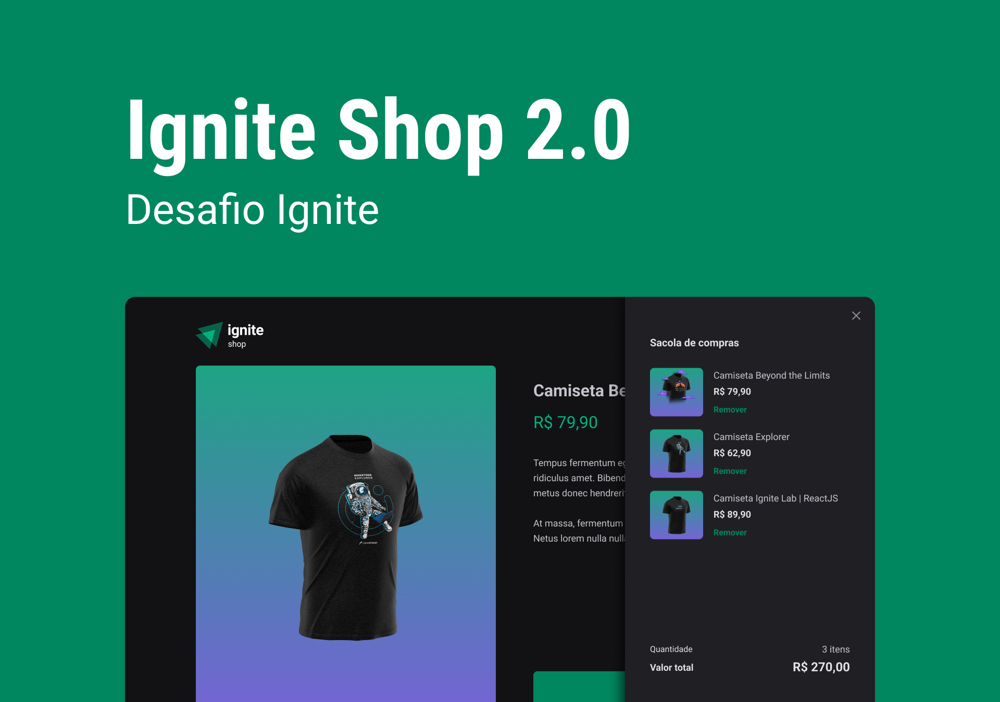

<p>
    
</p>

## :computer: Projeto

Este é um projeto feito durante o Projeto 04 do Ignite da Rocketseat, onde pude construir uma conexão com stripe para buscar os produtos(camisetas) e realizar o checkout de pagamento. De início foi um projeto de aprendizado, e posteriormente virou um desafio com algumas funcionalidades, como por exemplo:

- Criar fluxo de carrinho
- Fazer o checkout de pagamento de mais de um produto com o stripe
- Mudanças no layout

## :rocket: Tecnologias

- [React](https://reactjs.org)
- [Typescript](https://www.typescriptlang.org)
- [Stitches JS](stitches.dev)
- [Keen Slider](https://keen-slider.io)
- [Stripe](https://stripe.com/br)

## :thinking: Como rodar o projeto?

1. Execute `npm i` para instalar as dependências

2. Configurações no [stripe](https://dashboard.stripe.com/test/dashboard):
   2.1 Crie uma conta e crie um projeto Ignite Shop(ou outro nome de sua preferência)
   2.2 Vá em **Produtos** e adicione alguns produtos com `imagens, descrição e preço`. Se preferir usar as imagens das camisetas, basta ir em `src > assets > camisetas` aqui mesmo no github.
   2.3 Volte na página inicial do stripe e va em `Desenvolvedores > Chaves da API`. Na raiz do projeto crie um arquivo `.env.local`, e salve a chave pública e secreta da seguinte forma:

   ```env
    # App
    NEXT_URL=http://localhost:3000 <- adicione essa linha também

    # Stripe
    STRIPE_PUBLIC_KEY=sua_chave_publica
    STRIPE_SECRET_KEY=sua_chave_secreta
   ```

3. Execute `npm run dev` para rodar o projeto

4. [Abra o navegador na porta 3000](http://localhost:3000)

5. Caso queira simular o pagamento, basta acessar essa [documentação do stripe](https://stripe.com/docs/testing#cards) para pegar um cartão válido para teste.
